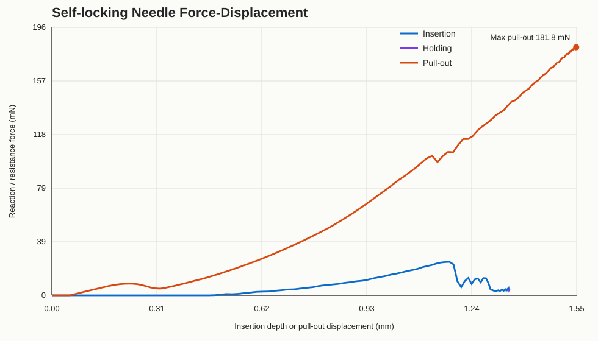

<div align="center">

# Microneedle Skin Pull-out Simulation (Abaqus)

**Abaqus/Explicit simulation of a self-locking (barbed) microneedle puncturing layered skin**
— built end-to-end by an AI coding agent (Codex) through MCP-driven automation.

[Features](#-features) · [Demo](#-demo) · [Quick Start](#-quick-start) · [Project Structure](#-project-structure) · [How It Was Built](#-how-it-was-built) · [Results](#-results) · [Limitations](#-limitations)

</div>

---

## 🧬 What Is This?

This repository contains a complete, runnable **finite-element simulation of a self-locking (barbed) microneedle** being inserted into, held inside, and pulled out of **layered human skin**. The skin is modeled as a three-layer hyperelastic-viscoplastic material (Ogden + Prony series), with **hard contact, friction, large sliding and large deformation** — capturing the *elasticity, viscoelasticity (sticking), and frictional* behavior you asked about.

The whole workflow — geometry reconstruction from STEP, meshing, material assignment, contact setup, explicit solve, post-processing, and browser visualization — was driven by an **AI coding agent (OpenAI Codex) through an MCP toolchain**, without manual GUI interaction. This repository is therefore also a **worked example of AI-automated CAE**.

> 中文简介:本项目是**自锁(倒刺)微针穿刺皮肤**的 Abaqus/Explicit 有限元仿真,皮肤为三层 Ogden 超弹 + Prony 黏弹性材料,包含硬接触、摩擦(μ=0.38)、大滑移。整个流程(STEP 几何重建 → 网格 → 材料 → 接触 → 显式求解 → 后处理 → 浏览器可视化)由 **Codex AI 代理 + MCP 工具链**自动化完成,无需手工操作 GUI。既是一个微针力学仿真,也是一个 **AI 自动化 CAE** 的完整示例。

## ✨ Features

- 🧷 **Self-locking barbed microneedle** reconstructed from STEP geometry (shaft Ø0.2 mm, barb Ø0.391 mm, barb overhang 0.0955 mm)
- 🩹 **Three-layer skin** (epidermis / dermis / hypodermis) with **Ogden N=1 hyperelasticity + Prony viscoelasticity** — elasticity, stress relaxation and rate-dependent stickiness
- 🔩 **Hard contact + Coulomb friction (μ=0.38)**, general contact, finite sliding, allow separation/re-contact
- 🎯 **Three-phase RP-controlled loading**: Insertion (−1.35 mm) → Holding (relaxation) → Pull-out (+0.20 mm)
- 🧪 **VUMAT skin-damage subroutine** (`vumat_skin_damage.for`) — rate-dependent damage with element deletion, ready for the next version
- 📊 **Post-processing scripts** extract force–displacement curves and energy ratios; **browser viewer** exports interactive stress / strain / displacement / contact-pressure scenes
- 🤖 **AI-automated pipeline** — every step generated and executed by Codex via MCP

## 🎬 Demo

**完整仿真过程（插入 → 保持 → 拔出，浏览器 3D 可视化）：**

<video src="演示视频.mp4" controls="controls" width="720"></video>

*屏幕录制：倒刺微针插入三层皮肤 → 保持 → 拔出的完整显式动力学过程*

**力-位移曲线（自锁机理的关键证据）：**



*Force (RP reaction, N) vs displacement (mm) across the three phases. The peak on the left is the barb's mechanical interlock during pull-out.*

| 资源 | 说明 |
|------|------|
| `演示视频.mp4` | 完整仿真 3D 可视化（插入 → 保持 → 拔出） |
| `self_locking_force_displacement_curve.svg/.html/.csv` | 力-位移曲线（0.18N 峰值 = 倒刺自锁） |

## 🚀 Quick Start

Requires **Abaqus 2024+** (Abaqus/CAE + Abaqus/Explicit), Python 3.10+ (for the browser exporter), and a STEP-capable CAD workflow.

```bash
# 1. Rebuild the model and write the INP (runs inside Abaqus/CAE)
abaqus cae noGUI=self_locking_needle_pullout.py

# 2. Solve (Explicit)
powershell -ExecutionPolicy Bypass -File run_self_locking_solve.ps1

# 3. Post-process: force–displacement & energy curves
abaqus python postprocess_self_locking.py

# 4. Export browser-viewer scenes (stress / strain / displacement / contact pressure)
abaqus python export_self_locking_browser_results.py
```

> Windows note: the solve script defaults to `D:\SIMULIA\Commands\abaqus.bat` — edit the `$abaqus` variable in `run_self_locking_solve.ps1` to match your installation.

## 📁 Project Structure

```
microneedle-skin-pullout/
├── self_locking_needle_pullout.py   # Main Abaqus/CAE modeling script (geometry→mesh→material→contact→steps)
├── run_self_locking_solve.ps1       # Explicit solver launcher with live .sta progress tailing
├── postprocess_self_locking.py      # ODB post-processing → force-displacement & energy CSVs
├── export_self_locking_browser_results.py  # ODB → interactive browser viewer JSON
├── vumat_skin_damage.for            # VUMAT: rate-dependent skin damage + element deletion (unused in this run)
├── needle.STEP                      # Ordinary microneedle geometry (earlier stage)
├── Self-locking needle.STEP         # Barbed / self-locking microneedle geometry (μm)
├── skin.STEP                        # Skin sample geometry (mm)
├── self_locking_model_metadata.json # Full model card: materials, mesh, steps, contact
├── self_locking_force_displacement_curve.{csv,svg,html}
├── self_locking_energy_history.csv
├── self_locking_browser_viewer/     # Interactive viewer data (stress/strain/displacement/contact-pressure)
└── 演示视频.mp4                      # Demo video
```

## 🤖 How It Was Built (Codex + MCP automation)

> 🔒 Privacy note: this repository has been sanitized. No local paths, usernames, tokens or API keys are committed. The original environment included a **text-to-cae MCP server** (a third-party MCP that lets an LLM build, run and post-process Abaqus models through natural language); this repo keeps only the *artifacts* and *scripts* that pipeline produced, so anyone can re-run them — or re-create the pipeline — without the MCP.

### The workflow, as executed

| Stage | What Codex did | Output |
|---|---|---|
| **1. Geometry** | Read `Self-locking needle.STEP` + `skin.STEP`, auto-detected units (μm vs mm), extracted key dimensions (shaft Ø, barb Ø, overhang, lead cone) via regex parsing of STEP CARTESIAN_POINTs | `self_locking_model_metadata.json` |
| **2. Rebuild** | Rebuilt the needle as a rigid-body contact surface and the skin as a 3.6 mm Ø × 2.0 mm annular coupon with a pilot puncture channel; mapped STEP Y → model Z | `self_locking_needle_pullout.py` |
| **3. Material** | Three-layer Ogden (N=1) + Prony viscoelastic: epidermis μ=0.075 MPa α=8.5 D₁=1.5 · dermis μ=0.030 MPa α=7.5 D₁=0.8 · hypodermis μ=0.006 MPa α=6.0 D₁=8.0 | model keywords |
| **4. Contact** | General contact, Hard normal + penalty friction μ=0.38, finite sliding | `*ContactExp` |
| **5. Solve** | Wrote INP, launched `abaqus job=… cpus=4` through PowerShell, tailed `.sta` until `THE ANALYSIS HAS COMPLETED SUCCESSFULLY` | `.odb`, `.sta` |
| **6. Post-process** | Extracted RP history (U3/RF3), ALLKE/ALLIE/ALLVD, computed max pull-out force, retention force, energy ratios | `.csv`, `…summary.json` |
| **7. Visualize** | Exported reduced frames → interactive browser scenes (stress/strain/displacement/contact pressure) | `self_locking_browser_viewer/` |
| **8. Curate** | Cleanup manifest tracked removed stale outputs; READMEs documented each stage | `README_*.md` |

### The MCP layer (as it was configured)

- **Server**: a third-party **`text-to-cae` MCP server** (`~/.codex/mcp/text-to-cae/`) exposing tools such as *build model, run job, post-process ODB, export browser viewer*.
- **Client**: Codex CLI (`config.toml` → `[mcp_servers.*]`) registered the server; the agent called its tools step-by-step, verifying outputs after each stage.
- **Orchestration**: prompts in natural language ("build the pull-out model from these STEPs…", "solve with mass scaling target 1e-6 s…", "export the stress scene…"), with the agent writing the actual Abaqus Python scripts reproduced here.
- **Result**: an end-to-end CAE run — STEP to interactive results — with **zero manual GUI clicks**.

> 💡 The `text-to-cae` MCP itself is **not included** in this repository (third-party, and its live copy on this machine has since been replaced by other MCP integrations). The scripts here are the complete, re-runnable output of that pipeline — re-run them with any Abaqus installation and you reproduce the simulation and all figures.

## 📊 Results

| Metric | Value |
|---|---|
| **Max pull-out force** (barb interlock) | **0.1818 N** (at RP U3 = +0.198 mm, t ≈ 0.433 s) |
| **Retention force** (holding phase) | 0.00415 N |
| Pull-out phase max ALLKE/|ALLIE| | ≈ 0.00113 (quasi-static ✓) |
| Final ALLKE/|ALLIE| | ≈ 9.2e-6 |
| Mesh | Skin 6,970 nodes / 5,967 elems · Needle 2,083 nodes / 7,974 elems |
| Explicit mass scaling | ~3.8–4.0% added mass, target Δt = 1.0e-6 s |
| Solver | Abaqus/Explicit, 3 steps (Insertion 0.10 s / Holding 0.18 s / Pull-out 0.16 s) |

**Key finding**: the self-locking barb creates a distinct mechanical interlock — pull-out force peaks at **0.18 N**, an order of magnitude above the retention force, exactly the "insertion is easy, extraction is hard" property a self-locking microneedle needs.

## ⚠️ Limitations & Next Steps

- The stable run uses a **pilot puncture channel** (pre-made hole) rather than modeling crack initiation/tearing — the sharp-tip insertion fracture is *represented*, not *simulated*. The VUMAT (`vumat_skin_damage.for`) is the starting point for a damage/cohesive version.
- `general contact deep penetration` warnings appear locally at the barb shoulder — treat peak contact pressures as upper bounds.
- Ogden/Prony parameters are **literature-level approximations**, not fitted to experimental data. Re-calibrate if you have tensile/relaxation curves.
- Next: local mesh refinement at the barb shoulder, VUMAT with element deletion, and parameter sweeps (barb angle, insertion speed) for design optimization.

## 📄 License

MIT License — see [LICENSE](LICENSE). The STEP geometry files and simulation scripts are provided as-is for research and educational use.
